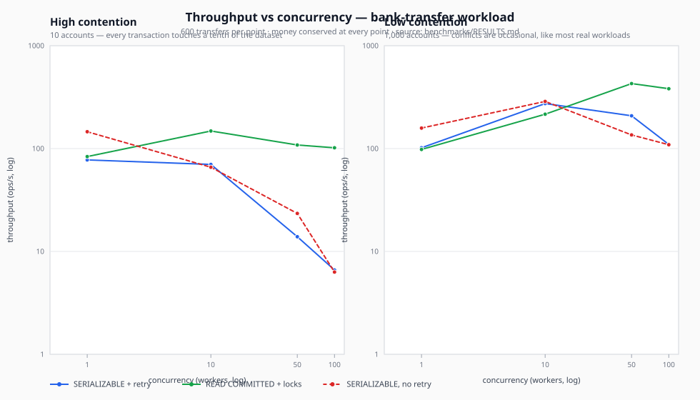

# Benchmark results

Generated by `pnpm bench` on 2026-08-12T05:47:04.906Z.

Every number here was measured on the run described below. Nothing is estimated.

## Workload

600 transfers per configuration (plus 60 warmup), each a
**read-then-write**: read both balances, check the source can cover the amount, then
debit and credit. Source and destination are picked at random from the account pool.

Two contention profiles are measured, because either one alone would mislead:

- **10 accounts** — every transaction touches a fifth of the dataset. Pathological.
- **1,000 accounts** — conflicts are occasional, which is what most real workloads
  look like.

Treat the _shape_ of the curves as the finding, not the absolute throughput.

## Environment

|            |                                                                                          |
| ---------- | ---------------------------------------------------------------------------------------- |
| PostgreSQL | PostgreSQL 17.10 on x86_64-pc-linux-musl, compiled by gcc (Alpine 15.2.0) 15.2.0, 64-bit |
| Image      | postgres:17-alpine                                                                       |
| Node       | v24.14.1                                                                                 |
| CPU        | 13th Gen Intel(R) Core(TM) i7-1355U (12 threads)                                         |
| Platform   | Linux 6.8.0-136-generic                                                                  |
| Pool size  | 120                                                                                      |

Containerised PostgreSQL on the same machine as the client, so absolute latency is
optimistic compared with a real network hop.

## Results

Latencies are milliseconds per successful transfer, measured end to end **including
every retry** — the number a caller actually experiences.

### high contention (10 accounts)

| Strategy               | Concurrency | Throughput (ops/s) |     p50 |      p95 |      p99 | Retries | Failed | Failure rate | Money conserved |
| ---------------------- | ----------: | -----------------: | ------: | -------: | -------: | ------: | -----: | -----------: | :-------------: |
| SERIALIZABLE + retry   |           1 |               77.6 |    8.39 |    36.04 |    70.04 |       0 |      0 |         0.0% |       yes       |
| SERIALIZABLE + retry   |          10 |               70.1 |   76.48 |   498.04 |   715.17 |     998 |      0 |         0.0% |       yes       |
| SERIALIZABLE + retry   |          50 |               13.9 | 1560.32 |  7400.75 |  9558.52 |    5053 |     67 |        11.2% |       yes       |
| SERIALIZABLE + retry   |         100 |                6.6 | 3781.45 | 16039.08 | 18515.58 |   10164 |    294 |        49.0% |       yes       |
| READ COMMITTED + locks |           1 |               83.6 |    7.78 |    31.68 |    61.41 |       0 |      0 |         0.0% |       yes       |
| READ COMMITTED + locks |          10 |              148.2 |   50.67 |   169.23 |   320.44 |       0 |      0 |         0.0% |       yes       |
| READ COMMITTED + locks |          50 |              108.3 |   99.75 |  1790.48 |  3704.13 |       0 |      0 |         0.0% |       yes       |
| READ COMMITTED + locks |         100 |              101.7 |   205.3 |  4354.92 |  5529.77 |       0 |      0 |         0.0% |       yes       |
| SERIALIZABLE, no retry |           1 |              145.9 |    4.99 |    17.95 |    30.16 |       0 |      0 |         0.0% |       yes       |
| SERIALIZABLE, no retry |          10 |               65.9 |   30.17 |   232.84 |   287.75 |       0 |    384 |        64.0% |       yes       |
| SERIALIZABLE, no retry |          50 |               23.4 |  122.57 |   477.15 |   515.22 |       0 |    547 |        91.2% |       yes       |
| SERIALIZABLE, no retry |         100 |                6.3 |  522.12 |  1733.15 |  2064.89 |       0 |    576 |        96.0% |       yes       |

### low contention (1,000 accounts)

| Strategy               | Concurrency | Throughput (ops/s) |    p50 |     p95 |     p99 | Retries | Failed | Failure rate | Money conserved |
| ---------------------- | ----------: | -----------------: | -----: | ------: | ------: | ------: | -----: | -----------: | :-------------: |
| SERIALIZABLE + retry   |           1 |              101.8 |   5.87 |   29.98 |   64.25 |       0 |      0 |         0.0% |       yes       |
| SERIALIZABLE + retry   |          10 |              273.7 |  25.93 |  100.83 |  159.35 |      98 |      0 |         0.0% |       yes       |
| SERIALIZABLE + retry   |          50 |              208.4 | 159.23 |   648.8 |  989.86 |     669 |      0 |         0.0% |       yes       |
| SERIALIZABLE + retry   |         100 |              109.8 | 451.45 | 2921.08 | 3793.98 |    1484 |      0 |         0.0% |       yes       |
| READ COMMITTED + locks |           1 |               98.1 |   7.49 |   26.98 |   48.71 |       0 |      0 |         0.0% |       yes       |
| READ COMMITTED + locks |          10 |              215.7 |  44.14 |   80.89 |  102.61 |       0 |      0 |         0.0% |       yes       |
| READ COMMITTED + locks |          50 |              428.4 | 106.86 |  212.67 |  267.64 |       0 |      0 |         0.0% |       yes       |
| READ COMMITTED + locks |         100 |                382 | 222.22 |  486.27 |  619.15 |       0 |      0 |         0.0% |       yes       |
| SERIALIZABLE, no retry |           1 |              158.3 |   4.95 |   15.27 |   32.77 |       0 |      0 |         0.0% |       yes       |
| SERIALIZABLE, no retry |          10 |              287.4 |  23.81 |   57.08 |   73.42 |       0 |    102 |        17.0% |       yes       |
| SERIALIZABLE, no retry |          50 |              135.8 |  73.14 |  165.72 |  203.47 |       0 |    440 |        73.3% |       yes       |
| SERIALIZABLE, no retry |         100 |                109 |  90.31 |  160.57 |  168.03 |       0 |    522 |        87.0% |       yes       |



The chart is drawn from the tables above by `pnpm chart`, which `pnpm bench` runs for you —
so it cannot drift from the numbers it plots.

Money was conserved at **every** point on the matrix, including where transactions failed.
Unretried SERIALIZABLE loses _work_, never _money_: PostgreSQL refuses the conflicting
transaction rather than corrupting the balance.

## Findings

Computed from the table above, not written by hand.

- **high contention (10 accounts), 100 concurrent workers.** Unretried SERIALIZABLE fails **96%** of transactions (576 of 600). Adding retry takes that to **49%**, at 6.6 ops/s against 6.3. Pessimistic locking under READ COMMITTED manages 101.7 ops/s with no failures, at a p99 of 5529.77ms against 18515.58ms.

- **low contention (1,000 accounts), 100 concurrent workers.** Unretried SERIALIZABLE fails **87%** of transactions (522 of 600). Adding retry takes that to **0%**, at 109.8 ops/s against 109. Pessimistic locking under READ COMMITTED manages 382 ops/s with no failures, at a p99 of 619.15ms against 3793.98ms.

- **Retries are not free.** Under high contention, SERIALIZABLE + retry goes from 77.6 ops/s at concurrency 1 to 6.6 ops/s at concurrency 100 — throughput _falls_ as workers are added, because every conflict costs a whole transaction's work. This is the effect `maxAttempts`, `backoff.capMs`, and `timeoutMs` exist to bound.

### What to take from this

Retry is what makes SERIALIZABLE _usable_ — it converts a large fraction of outright
failures into completed work. It does not make SERIALIZABLE _fast_. When you can
enumerate the rows a transaction will touch, ordered pessimistic locking under
READ COMMITTED is consistently faster and degrades more gracefully, which is why
`lockRowsInOrder()` ships in this library alongside the retry engine.

Reach for SERIALIZABLE + retry when the correctness property you need is one only
serializability provides — write skew across rows you cannot name in advance, the
on-call-doctors shape. Reach for ordered locks when you can name the rows. Measure
your own workload before choosing; the contention profile matters more than either
strategy.

## Reproducing

```bash
pnpm preflight
pnpm bench
```

Against a different PostgreSQL version:

```bash
PG_IMAGE=postgres:14-alpine pnpm bench
```

The harness is `benchmarks/contention.bench.ts`; the workload is shared with the
invariant test in `test/integration/invariants.spec.ts`, so both measure the same
thing.
